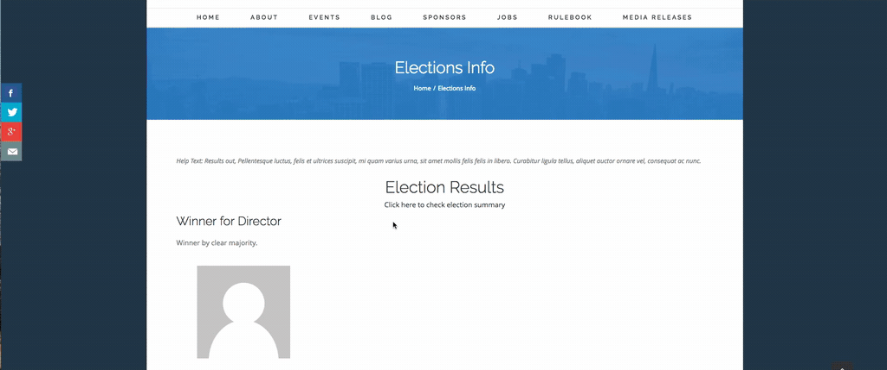

**Elections** (au.com.agileware.elections) is a CiviCRM extension which provides on-line election functionality (nominations and voting) to CiviCRM.

Using this extension you can run as many elections you want using your CiviCRM site. This extension also provides the unique ability to control who can participate in each election using CiviCRM Groups and CiviCRM Smart Groups. So you can run elections for country, regional, state-based or any criteria at all.

Election results are calculated using the [Instant-runoff voting (IRV) method] (https://en.wikipedia.org/wiki/Instant-runoff_voting)

Election process is based on the Voting features which were originally implemented in [MemberDB](https://www.flamingspork.com/projects/memberdb/)

Each election has individual settings which provide these capabilities:

1. Each election can be assigned unique dates for each stage of the process.
1. Restrict participation in a specific election using CiviCRM Groups and CiviCRM Smart Groups.
1. Number of nominations required for a person to become an eligible candidate for each election.
1. Allow or disallow a user to change their vote.
1. Anonymise votes after the election results are posted.

Viewing election results are shown below as an example.

  

Sponsorship
------

Development of this CiviCRM extension and development of the PHP Unit Tests was kindly sponsored by [Linux Australia](https://linux.org.au).

 

About the Authors
------

This CiviCRM extension was developed by the team at [Agileware](https://agileware.com.au).

[Agileware](https://agileware.com.au) provide a range of CiviCRM services including:

  * CiviCRM migration
  * CiviCRM integration
  * CiviCRM extension development
  * CiviCRM support
  * CiviCRM hosting
  * CiviCRM remote training services

Support your Australian [CiviCRM](https://civicrm.org) developers, [contact Agileware](https://agileware.com.au/contact) today!


  

Prerequisites
-------------

  * [CiviCRM](https://www.civicrm.org) 4.7 or greater  

Installation
-------------

1. Download this repository(whole extension folder) to your CiviCRM extension directory (available at 'System Settings / Resource URLs').
1. In CiviCRM, go to 'System Settings / Extensions' and enable **Elections**.
1. 'Elections' will now be available in the 'CiviCRM' menu. 
1. Click on the 'Elections' menu to display the Elections page.

Getting Started
-------------

Read the [documentation](docs/index.md)  to get started setting up your first election.

WordPress Short-codes
-------------

The following WordPress short-codes are available to seamlessly integrate elections with your WordPress website.

**Election listing short-code**

This is used on a page to list all active and completed elections.

```[civicrm component="elections" hijack="0" action="visible" viewpageid="XXXX"]```

When using the Election listing short-code, replace the **XXXX** (viewpageid) with the Post ID of the page where the Election information short-code embedded.

**Election information short-code**

This is used to display a single election which has been accessed from the election listing page.

```[civicrm component="electioninfo"  hijack="0"]```

When this page is accessed from the election listing page, the Election ID is passed to the Election information short-code using a URL parameter.