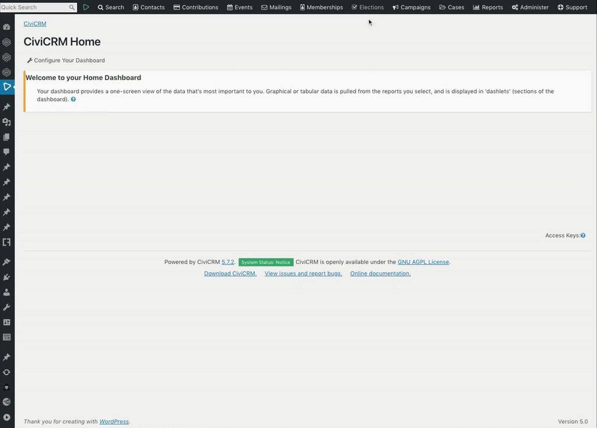
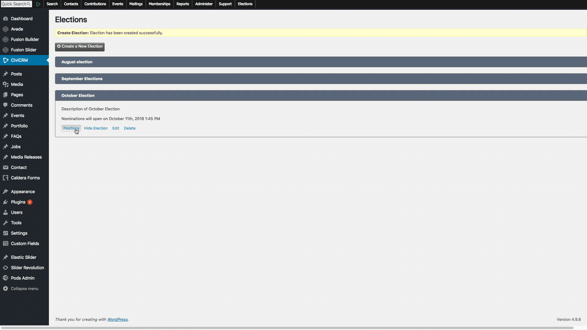
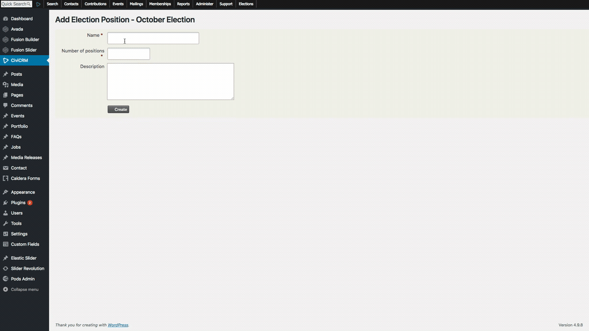
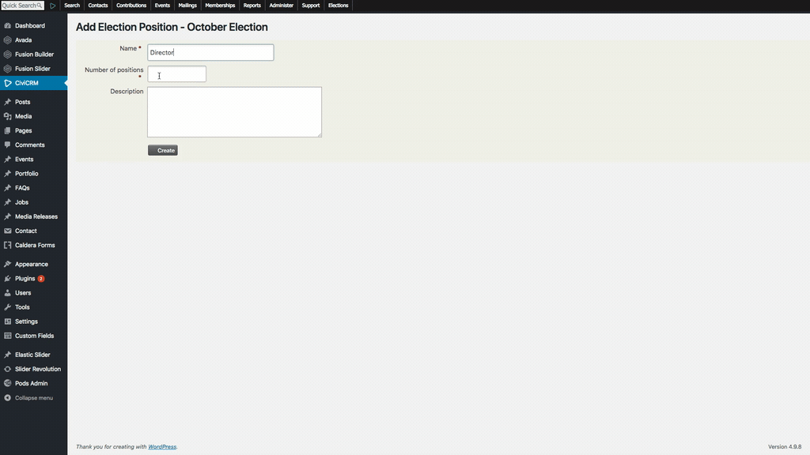
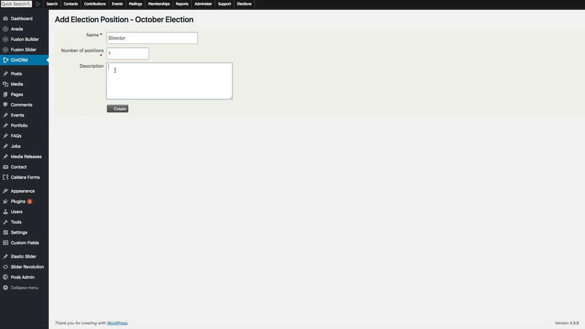

# How to add a position

To add a position, you need to have CiviCRM admin access and follow these steps:

1. Go to **Elections**
  
2. Go to **Positions > Add Position**     
  
3. Enter new information for an existing position  
-  **Position Name**: The title of the position  
  
-  **Seats**: The total number seats available for the position  
  
-  **Description**: A short description of the position  
  
Click **Create** to create the position
