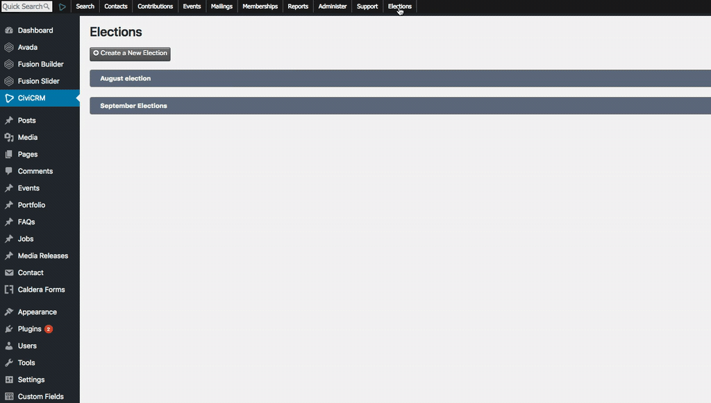
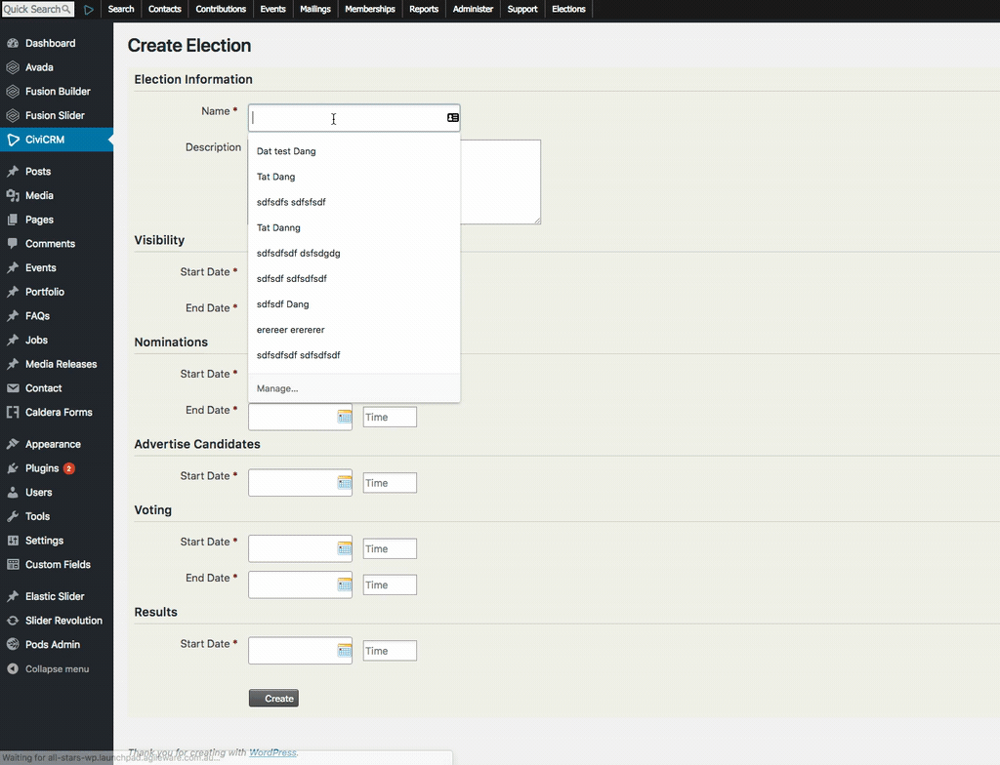
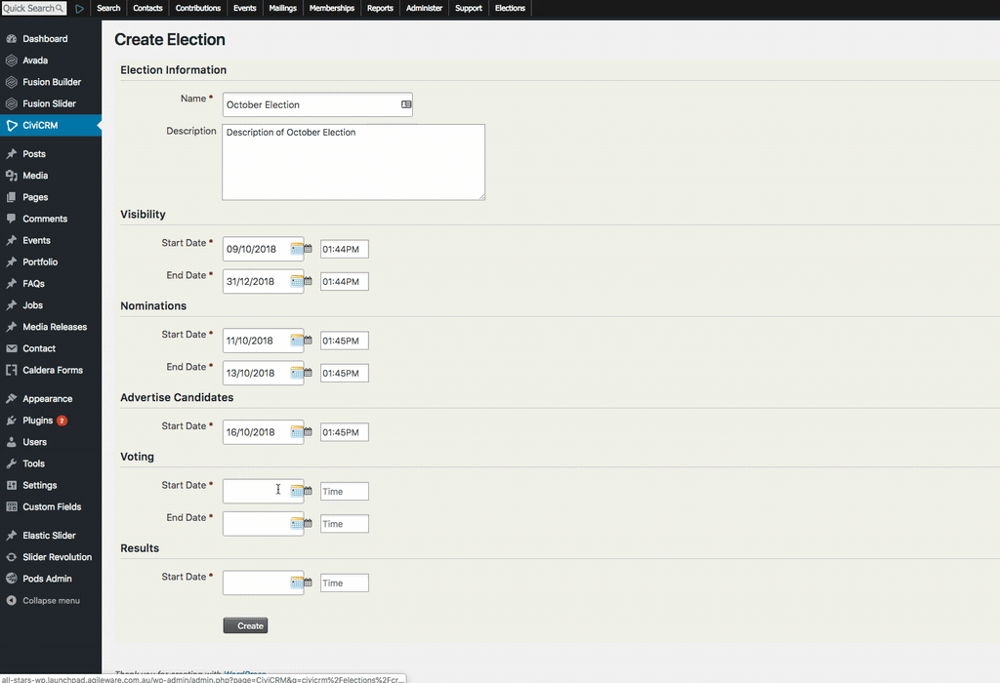

# How to create a new election

To create a new election, you should be a user who gains admin access for CiviCRM and follow these steps: 

1. Go to **Elections**  

2. Go to **Create Election**  

3. Enter information about the new election  
- **Name and Description**: enter the name and description of the new election. It helps users to know more about the election that they will participate.  

- **Visible Start Date**: set the date and time when user can start seeing it in the election section.  
- **Visible End Date**: set the date and time when the admin wants to hide the election from the election page.  
- **Nomination Start Date**: This date allows user to start nominating. This date should be after **Visible Start Date** and before **Visible End Date**  
- **Nomination End Date**: This date is to prevent user from nominating. This date should be after **Nomination Start Date** and before **Visible End Date**  
- **Advertise Start Date**: This date is to let user know that it waiting for nominees to accept their positions. This date should be after **Nomination End Date** and before **Visible End Date**  
- **Voting Start Date**: This date is to allow user to vote. This date should be after **Advertise Start Date** and before **Visible End Date**  
- **Voting End Date**: This date is to prevent user from voting. This date should be after **Voting Start Date** and before **Visible End Date**  
- **Results Start Date**: This date is to let users know when the results will be available. This date should be after **Voting End Date** and before **Visible End Date**  

Click **Create** to create a new election