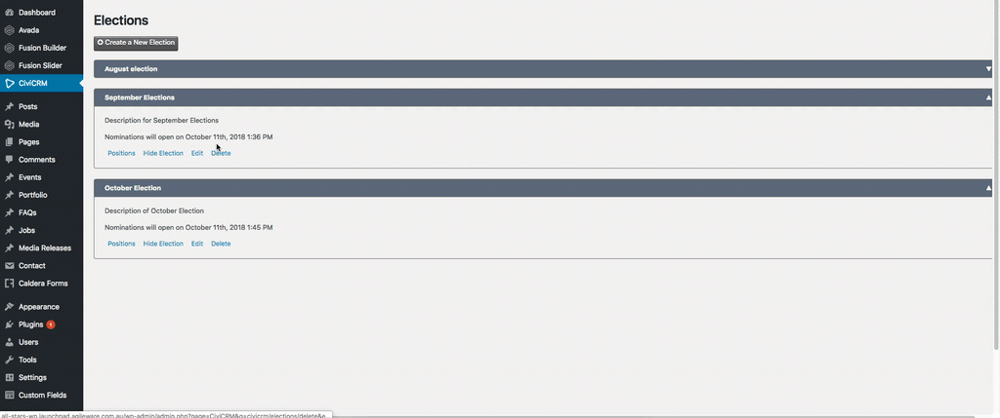

# How to delete an election

An election can only be deleted before its **Nomination Start Date** has passed while it is [active](admin_activate_election.md). Once nominations for an active election have started, it can no longer be deleted.

To delete an election, you should be a user who gains admin access for CiviCRM and follow these steps:

1. Go to **Elections**  
  
2. Go to **Delete > Delete**  
  

