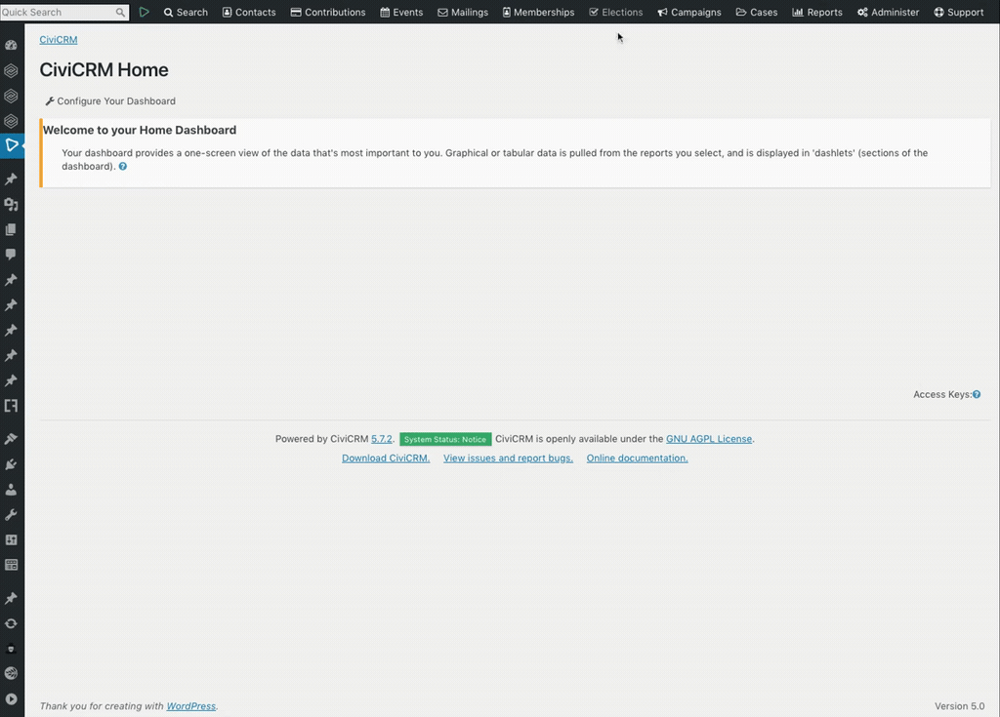
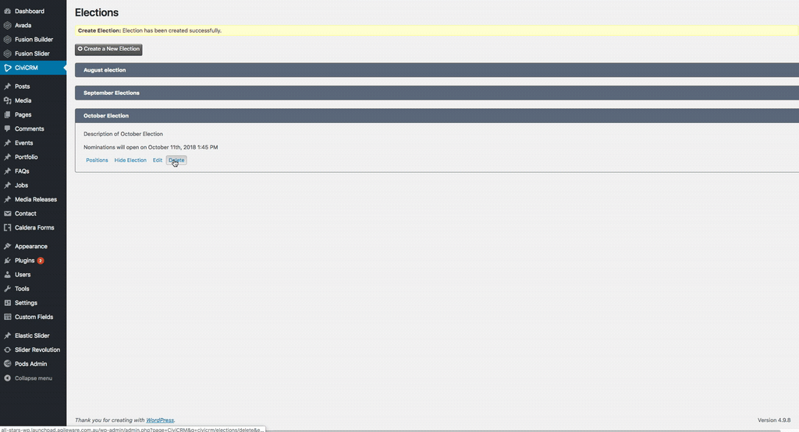
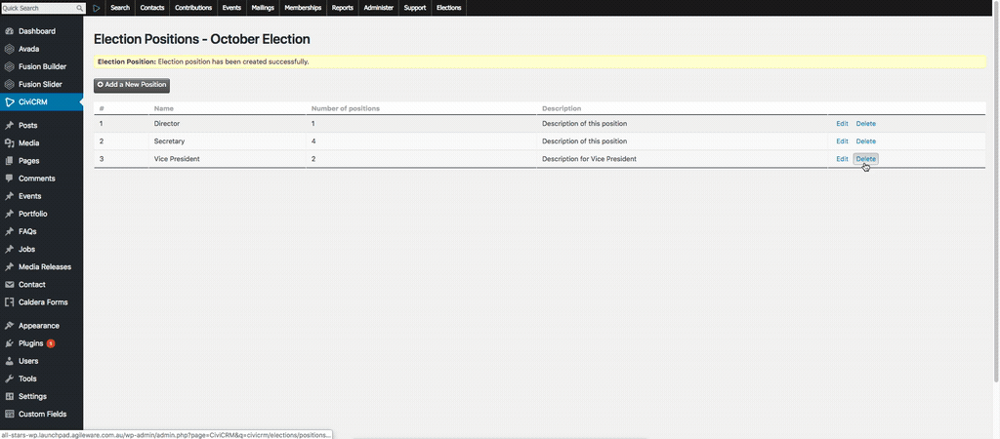

# How to delete a position

A position can only be deleted before the election's **Nomination Start Date**, or while the election is inactive.

To delete a position, you should be a user who gains admin access for CiviCRM and follow these steps:

1. Go to **Elections**  
  
2. Go to **Positions**  
  
3. Choose an election that you want to delete  
4. Click **Delete > Delete**  
