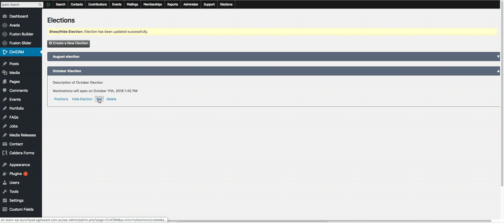

# How to edit an election

To edit an election, you should be a user who gains admin access for CiviCRM and follow these steps:

1. Go to **Elections**  
  
2. Go to **Edit**  
  
3. Edit information of an existing election    
- **Name and Description**: to edit the name and description of the election.  
- **Visible Start Date**: to edit the date and time when user can start seeing it in the election section.  
- **Visible End Date**: to edit the date and time when the admin wants to hide the election from the election page.  
- **Nomination Start Date**: to edit the nomination start date. This date should be after **Visible Start Date** and before **Visible End Date**  
- **Nomination End Date**: to edit the nomination end date. This date should be after **Nomination Start Date** and before **Visible End Date**  
- **Advertise Start Date**: to edit advertise start date. This date should be after **Nomination End Date** and before **Visible End Date**  
- **Voting Start Date**: to edit voting start date. This date should be after **Advertise Start Date** and before **Visible End Date**  
- **Voting End Date**: to edit voting end date. This date should be after **Voting Start Date** and before **Visible End Date**  
- **Results Start Date**: to edit results start date. This date should be after **Voting End Date** and before **Visible End Date**