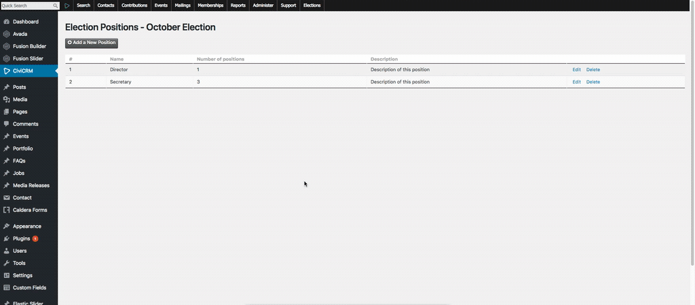
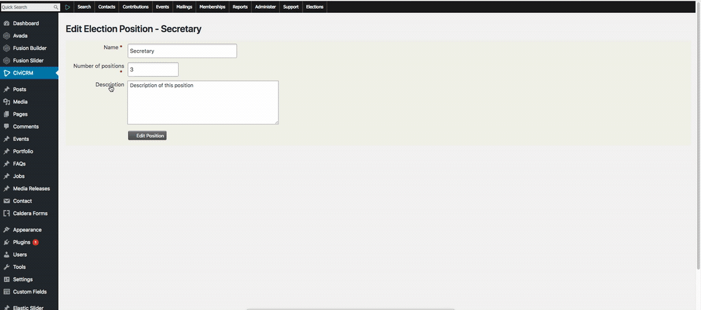

# How to edit a position

To edit a position, you should be a user who gains admin access for CiviCRM and follow these steps:

1. Go to **Elections**  
  
2. Go to **Positions > Edit**  
  
3. Enter new information for an existing position  
-  **Position Name**: To set the title of the position  
-  **Seats**: To setup the number of people for a position  
-  **Description**: To describe the position  
4. Click **Edit Position** to edit the position  
  

