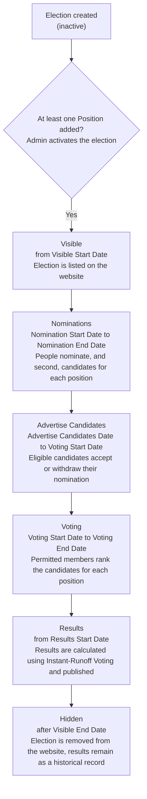
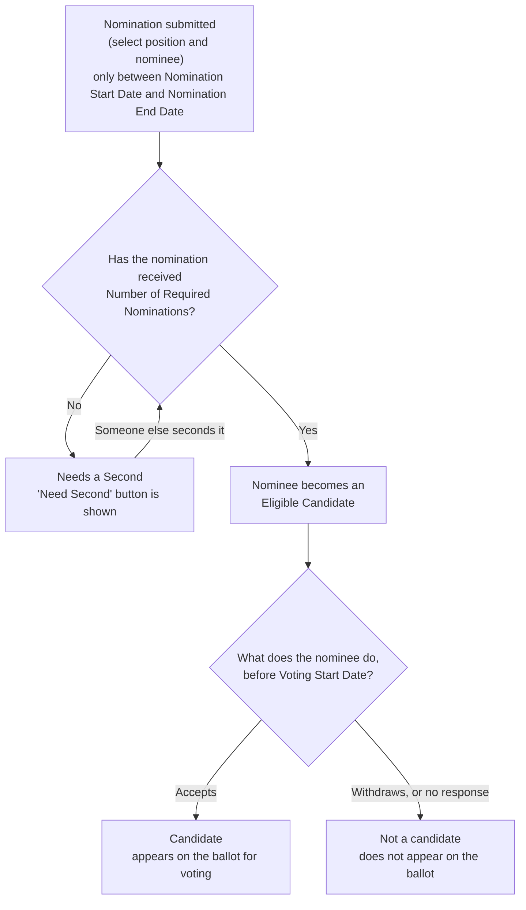

Elections (au.com.agileware.elections) is a CiviCRM extension which provides on-line election functionality (nominations and voting) to CiviCRM. 

The following sections describe the concepts and processes.

# Election Workflow Overview

An election moves through a fixed sequence of stages, each one gated by a date set when the election was created - see [Creating an Election](#creating-an-election). The diagram below shows the stages in order, the date that opens each one, and what happens at a high level during each stage.

An election which is not [activated](admin_activate_election.md), or which has no Positions, is never shown to end users, regardless of these dates. See [Nomination Workflow](#nomination-workflow) below for what happens to an individual nomination between the Nominations and Advertise Candidates stages.

# Initial Set Up
Before creating an election, follow these [initial set up steps](setup.md) to configure your website and CiviCRM to host elections. 

# Elections Settings

A single, site-wide settings page controls where candidate and nominee photos are sourced from. For more information, see [Elections Settings](admin_election_settings.md).

# Creating an Election
To create a new election, you should identify the date of each stage in the election's process as well as name and description of the election.   
- **Name and Description**: Title the election and provide a brief description of the reason for the election. For example, Name: 2020 Legislative Assembly election; Description: Election of the Legislative Assembly for the 5 electorates of the ACT: Brindabella, Ginninderra, Kurrajong, Murrumbidgee and Yerrabi.  
- **Visible Start Date**: The date that user can start seeing the election and the public will know about the election as well.  
- **Visible End Date**: The election will be invisible to the public after this date.  
- **Nomination Start Date**: Users allow to nominate from this date and it should be after **Visible Start Date** and before **Visible End Date**.    
- **Nomination End Date**: Users do not allow to nominate after this date and it should be after **Nomination Start Date** and before **Visible End Date**.     
- **Advertise Start Date**: Waiting for nominee to accept their position. This date should be after **Nomination End Date** and before **Visible End Date**.  
- **Voting Start Date**: Users can start voting from this date and it should be after **Advertise Start Date** and before **Visible End Date**.     
- **Voting End Date**: Users cannot vote from this date and it should be after **Voting Start Date** and before **Visible End Date**  
- **Results Start Date**: Users can check the election results from this date and it should be after **Voting End Date** and before **Visible End Date**.  

Each election also has its own settings, independent of the dates above:
- **Anonymise Votes**: whether votes are anonymised once results are published, so it's no longer possible to see how an individual voted.
- **Allow Members to Change Vote**: whether a member can vote again to change their vote before **Voting End Date**.
- **Allow non-logged in access**: whether people can nominate, accept nominations and vote using a personalised link, without logging in - see [Participating without logging in](setup.md#participating-without-logging-in).
- **Number of Required Nominations**: how many people must nominate a person for a position before they become an eligible candidate - see [Seconding a Nomination](#seconding-a-nomination) below.
- **Allowed by Groups**: the CiviCRM Groups and Smart Groups whose members are permitted to participate in the election.

For more information, see [How to create a new election](admin_create_election.md)  

# Activating an Election

A new election is created inactive, and is never visible to end users until it is activated. At least one Position must be added to the election before it can be activated.

For more information, see [How to activate or deactivate an election](admin_activate_election.md)

# Editing an Election  
To edit an election, you should follow the rules of date and time for each stage in **Create an election**. An election can only be edited before its **Nomination Start Date** has passed while it is active.

For more information, see [How to edit an election](admin_edit_election.md)

# Deleting an Election  

An election can only be deleted before its **Nomination Start Date** has passed while it is active.

To delete an election, see [How to delete an election](admin_delete_election.md)  

# Positions  

A person is nominated for one or more positions in an election.
Each election must have at least one position defined.
There are no limits to the seats which can be defined.
The CiviCRM administrator must define the positions available prior to the nomination stage for the election.
Positions are shown to end users in a defined order, which can be set when a position is added or edited, or changed afterwards - see [How to reorder positions](admin_reorder_positions.md).

## Adding a Position

A position only can be added before the **Nomination Start Date** or if the election is inactive.  
For more information, see [How to add a position](admin_add_position.md)  

## Editing a Position

A position only can be added before the **Nomination Start Date** or if the election is inactive.
For more information, see [How to edit a position](admin_edit_position.md)

## Deleting a Position

A position only can be deleted before the **Nomination Start Date** or if the election is inactive.
For more information, see [How to delete a position](admin_delete_position.md)  

# Nominations 

To nominate a user, see [How to nominate a user](user_nominate.md)
User cannot nominate after the **Nomination End Date**
A user can nominate any user including self, as set in the Settings for the Election
There is no limit for how many nominations a user can receive.
The minimum number of  nominations for a user to become a candidate is set in the Settings for the Election

## Nomination Workflow

Each nomination for a position moves through its own smaller workflow, shown below, before it can appear on the ballot.

A withdrawn nomination cannot be nominated again for the same position. For more information, see [How to nominate a user](user_nominate.md), [How to second a nomination](user_second_nomination.md), [How to accept a nomination](user_accept_nomination.md) and [How to withdraw a nomination](user_withdraw_nomination.md).

## Seconding a Nomination

If an election's **Number of Required Nominations** is more than 1, a nomination needs to be seconded by that many additional people before the nominee becomes an eligible candidate. For more information, see [How to second a nomination](user_second_nomination.md)

## Withdrawing a Nomination

A nominee can withdraw their own nomination at any time before **Voting Start Date**, whether or not it has been accepted. For more information, see [How to withdraw a nomination](user_withdraw_nomination.md)

# Accepting a Nomination  

A user must accept a nomination to become a candidate for any position. Only a nomination which has become an eligible candidate, by receiving the required number of nominations, can be accepted.
For more information, see [How to accept a nomination](user_accept_nomination.md)

# Voting  

User can only vote after **Voting Start Date** and before **Voting End Date**. If the election allows it, a user may vote again before **Voting End Date** to change their vote.
For more information, see [How to vote](user_vote.md)

# Results  

Results are published after the **Results Start Date**. Elections results are then available on the website, see example [election results](user_view_results.md)  
Election results are calculated using the Instant-runoff voting (IRV) method, see https://en.wikipedia.org/wiki/Instant-runoff_voting
  