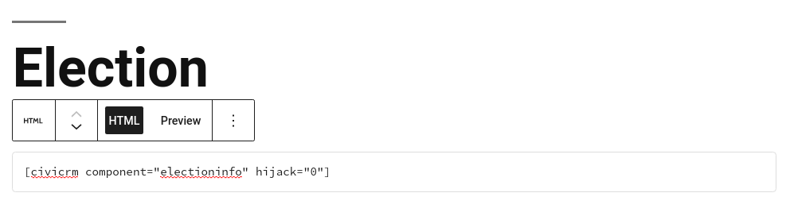
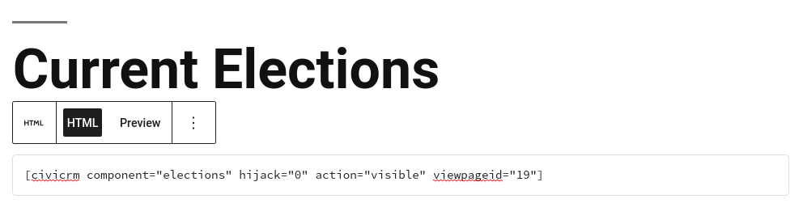
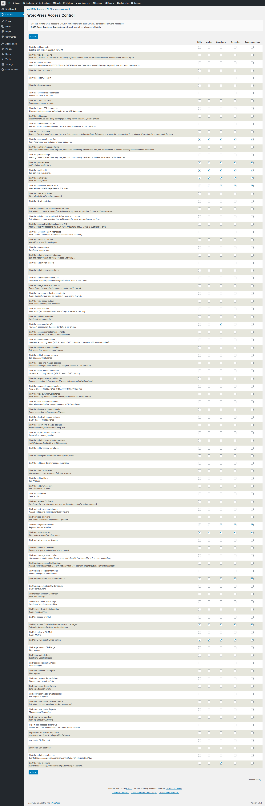

# Initial Set Up

This page documents the initial steps that need to be performed to configure your website and CiviCRM to host elections.

## Scheduled Jobs

CiviElections creates a new CiviCRM Scheduled Job, **Elections Results Job** on installation.
This Scheduled Job calculates the [election results](user_view_results.md) which are then displayed on the election results page.
This Scheduled Job is configured to execute **Always** and is **Enabled** by default.

If this Scheduled Job is not enabled or executed, then no election results will be calculated.  

## For WordPress/CiviCRM Sites

### Create Pages for the Election Listing and Individual Election
1. Create a Page to display the election information. This page can be called anything, but typically _Election_.
2. Insert the Election information short-code as a **HTML element** on the page: ```[civicrm component="electioninfo" hijack="0"]```
3. Publish the page and take note of the Page ID.

4. Create a Page to contain the listing of current elections. This page can be called anything, but typically _Current Elections_.
5. Insert the Election listing short-code as a **HTML element** on the page. Use the Page ID from the election information page as the _viewpageid_ parameter: ```[civicrm component="elections" hijack="0" action="visible" viewpageid="19"]``` - shown where the election information Page ID = 19.
6. Publish the page and take note of the Page ID.
 

### Set up CiviCRM Permissions

1. In CiviCRM, on the WordPress Access Control page,  _/wp-admin/admin.php?page=CiviCRM&q=civicrm%2Fadmin%2Faccess%2Fwp-permissions&reset=1_
2. Enable these two additional permissions for the **User Roles** that need to _participate in the election_
-  **CiviCRM: access AJAX API**
-  **CiviCRM: view elections**

Other default permissions which should already be enabled for the **User Role** role to interact with CiviCRM and will also be required are listed below.
-  **CiviCRM: access uploaded files**
-  **CiviCRM: profile create**
-  **CiviCRM: profile edit**
-  **CiviCRM: profile view**
-  **CiviCRM: access all custom data**

Screenshot below is an example permissions matrix.
  
  


