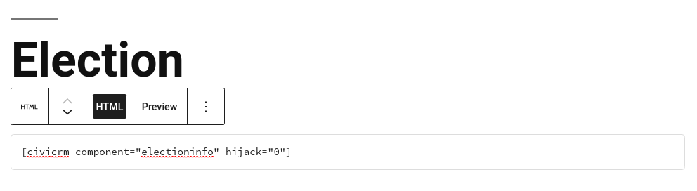
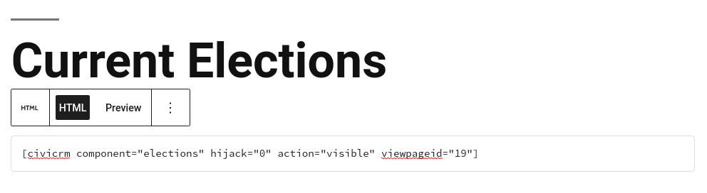
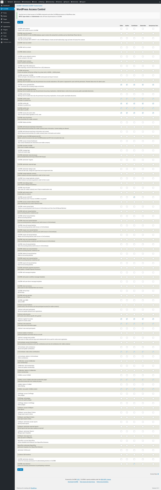

# Initial Set Up

This page documents the initial steps that need to be performed to configure your website and CiviCRM to host elections.

## Scheduled Jobs

CiviElections creates a new CiviCRM Scheduled Job, **Elections Results Job** on installation.
This Scheduled Job calculates the [election results](user_view_results.md) which are then displayed on the election results page.
This Scheduled Job is configured to execute **Always** and is **Enabled** by default.

If this Scheduled Job is not enabled or executed, then no election results will be calculated.  

## CiviCRM Permissions

This extension adds two CiviCRM permissions:

- **administer Elections**: Required by staff to create, edit, delete and activate elections and positions from the CiviCRM 'Elections' administration screens. Staff also need the core **administer CiviCRM** permission to see the 'Elections' and 'Elections Settings' items in the CiviCRM menu.
- **view Elections**: Required by end users to participate in elections, for example to view, nominate, accept nominations or vote. See below for the additional permissions required on WordPress/CiviCRM sites.

## Participating without logging in

By default, a user must be logged in to nominate, accept a nomination or vote. Each election has an **Allow non-logged in access** setting which, when enabled, allows a person to perform these actions using a personalised link containing their CiviCRM contact ID and checksum (`cid` and `cs` URL parameters), without needing to log in. This is useful for inviting people to participate who do not have a website user account.

A personalised link can be generated for a contact using CiviCRM's standard checksum tokens (for example `{contact.checksum}`) in a mailing or PDF letter, combined with the contact's ID, appended to the election page URL, for example: `https://example.org/elections/view?eid=1&cid={contact.contact_id}&cs={contact.checksum}`.

This extension also provides `election_name`, `election_position`, `nominator_name` and `nominee_name` tokens for the **Nomination** activity, and an `election_name` token for the **Vote** activity, for use when emailing people about their nominations or votes.

## For WordPress/CiviCRM Sites

### Create Pages for the Election Listing and Individual Election
1. Create a Page to display the election information. This page can be called anything, but typically _Election_.
2. Insert the Election information short-code as a **HTML element** on the page: ```[civicrm component="electioninfo" hijack="0"]```
3. Publish the page and take note of the Page ID.

4. Create a Page to contain the listing of current elections. This page can be called anything, but typically _Current Elections_.
5. Insert the Election listing short-code as a **HTML element** on the page. Use the Page ID from the election information page as the _viewpageid_ parameter: ```[civicrm component="elections" hijack="0" action="visible" viewpageid="19"]``` - shown where the election information Page ID = 19.
6. Publish the page and take note of the Page ID.
 

### Set up CiviCRM Permissions

1. In CiviCRM, on the WordPress Access Control page,  _/wp-admin/admin.php?page=CiviCRM&q=civicrm%2Fadmin%2Faccess%2Fwp-permissions&reset=1_
2. Enable these two additional permissions for the **User Roles** that need to _participate in the election_
-  **CiviCRM: access AJAX API**
-  **CiviCRM: view Elections**

Other default permissions which should already be enabled for the **User Role** role to interact with CiviCRM and will also be required are listed below.
-  **CiviCRM: access uploaded files**
-  **CiviCRM: profile create**
-  **CiviCRM: profile edit**
-  **CiviCRM: profile view**
-  **CiviCRM: access all custom data**

Screenshot below is an example permissions matrix.
  
  


