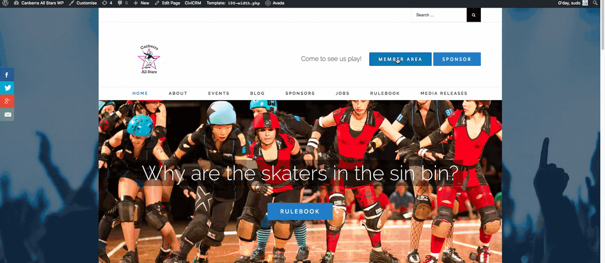
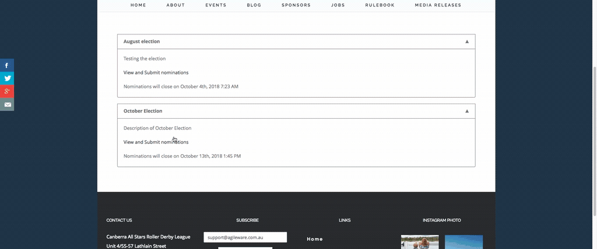
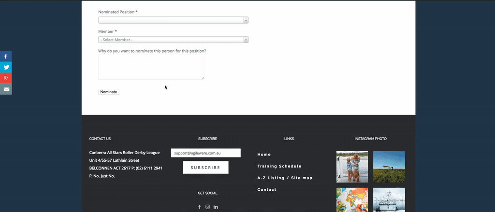
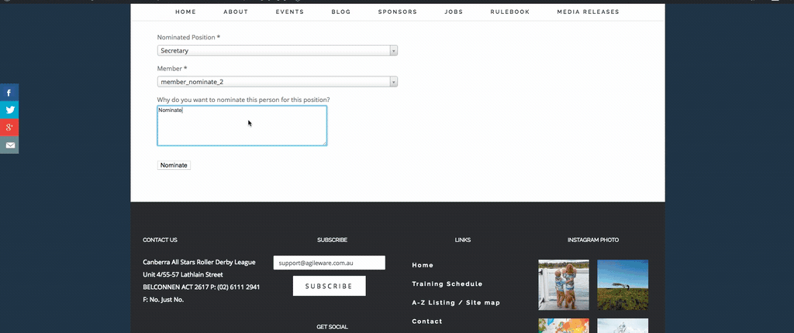

# How to nominate a user

You can nominate yourself, an existing nominees or a new person. Each nominee must be a permitted contact in CiviCRM (as defined in the Election Settings).

1. Go to **Elections**  
  
2. Go to **View And Submit Nomination**  
     
3. Enter information:
- **Nominated Position**: Choose the position that you want to nominate the user in  
- **Users**: Choose the name of the user that you want to nominate  
- Enter the reason why do you want to nominate this user  

4. Click **Nominate** to nominate

Depending on the election's settings, a nomination may need to be seconded by one or more other people before the nominee becomes an eligible candidate - see [How to second a nomination](user_second_nomination.md). The nominee can [withdraw the nomination](user_withdraw_nomination.md) at any time before voting starts.

