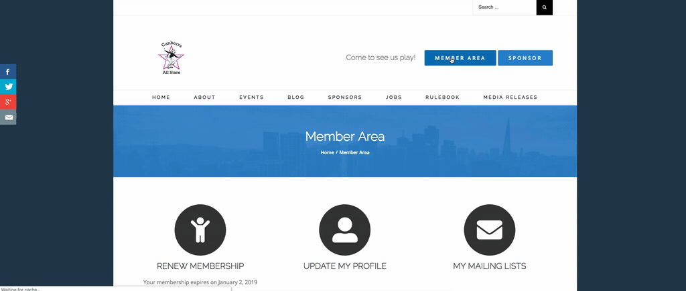
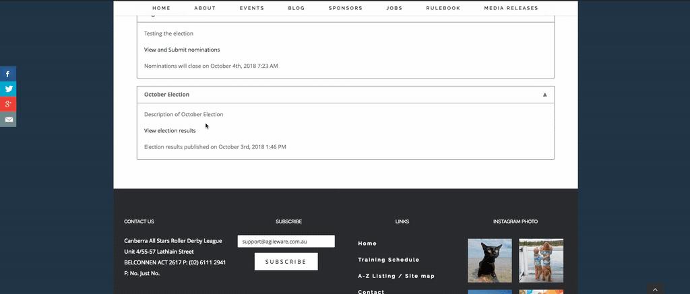

# How to view election results

Once the election results have been published, then this information is available to the public.

1. Go to **Elections**  
    
2. Go to **View Election Results**  
       
3. If you want to see the whole process of the election, go to **View Elections Summary**  
  