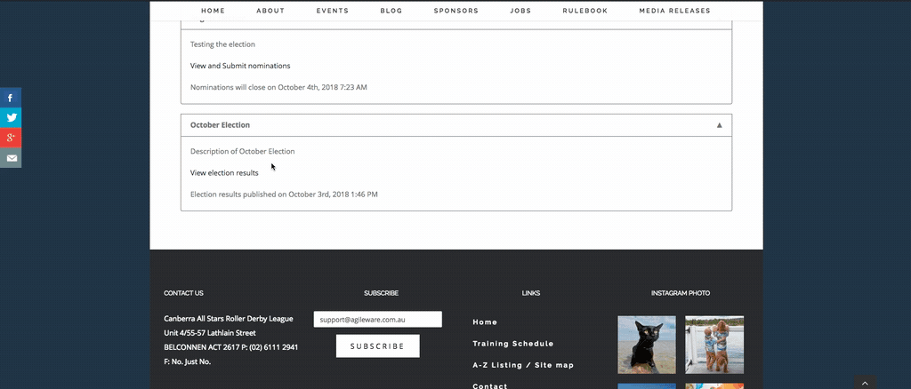

# How to view election results

Once the election results have been published, then this information is available to the public.

1. Go to **Elections**  
    
2. Go to **View Election Results**  
       
3. If you want to see the whole process of the election, go to **View Elections Summary**  
  

Each position's results show a status describing how the result was reached:

- **Winner by clear majority**: the winning candidate(s) received an outright majority of votes once preferences were distributed.
- **There was no clear majority winner between two candidates...**: after preferences were distributed, the final two candidates were tied, so both are shown as joint winners.
- **The number of candidates remaining equals the number of position holders**: enough candidates were eliminated during the count that all remaining candidates fill the available seats.
- **Not all seats were filled for this position**: there were not enough eligible candidates to fill every seat for the position.
- **There are not enough candidates for this position to generate a result**: no candidates had accepted their nomination for this position.