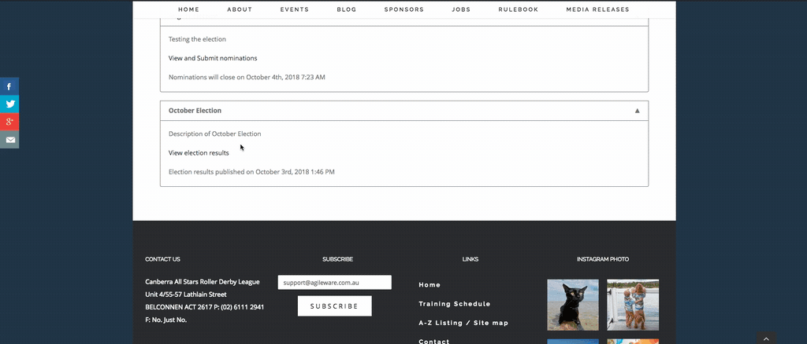

# How to view election results

Once the election results have been published, then this information is available to the public.

1. Go to **Elections**  
    
2. Go to **View Election Results**  
       
3. If you want to see the whole process of the election, go to **View Elections Summary**  
  

Each position's results show a status describing how the result was reached:

- **Winner by clear majority**: the winning candidate(s) received an outright majority of votes once preferences were distributed.
- **Elected by the most votes**: (elections counted by most votes) the candidates with the most votes fill the seats.
- **The result was a tie...**: the candidates were level across the last seat, so every tied candidate is listed with a **Tied** badge and none is chosen over the others. Candidates who clearly won keep the **Winner** badge.
- **The number of candidates remaining equals the number of position holders**: enough candidates were eliminated during the count that all remaining candidates fill the available seats.
- **Not all seats were filled for this position**: there were not enough eligible candidates to fill every seat for the position.
- **There are not enough candidates for this position to generate a result**: no candidates had accepted their nomination for this position.

## Questions

A yes or no question shows **Passed**, **Not passed** (including a tie) or **No quorum**, with the resolution. Counts are not shown.

The results page can have a logo, a header and a footer chosen by the organisers, and for a few days after the results are published it may show a short celebration (confetti, fireworks and so on). Press **Skip the celebration** or Escape to end it. Nothing is shown if your device asks for reduced motion.
