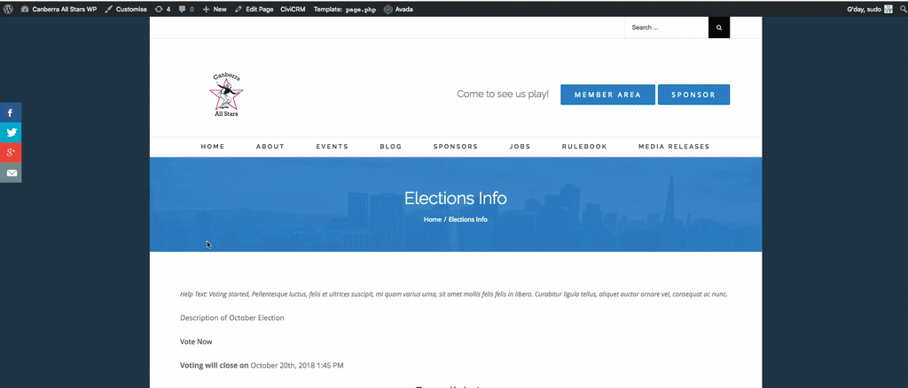
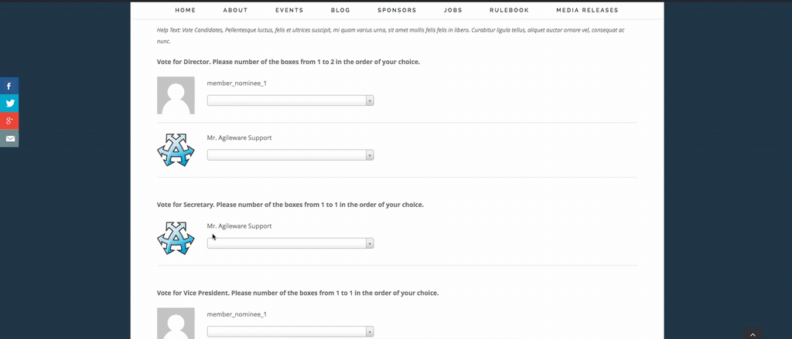
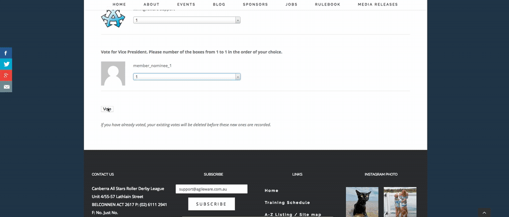

# How to vote

To vote in an election, you must be a permitted contact in CiviCRM (as defined in the Election Settings) and the election is in voting stage.

1. Go to the **Elections** page on the website
2. Go to required **Election**
3. Click the **Vote in the Election** link 
   
4. Click the **Vote Now** link
     
5. Rank each Candidate in order of preference for each Position.
     
6. Click **Vote** to record your vote.    
