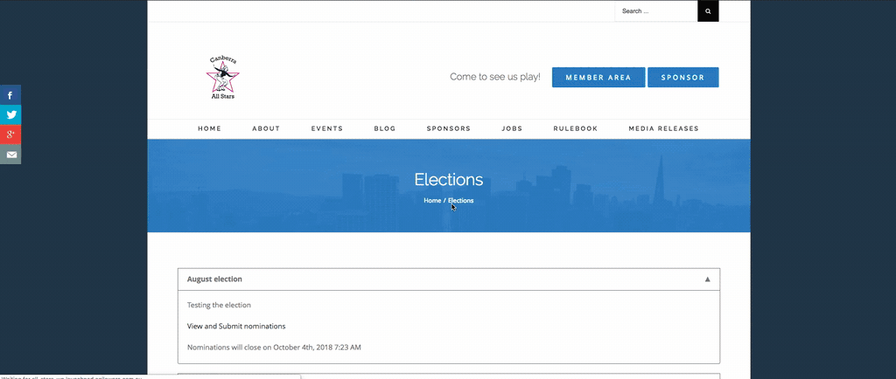
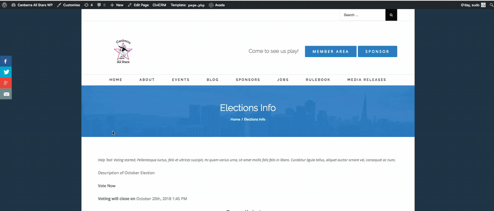
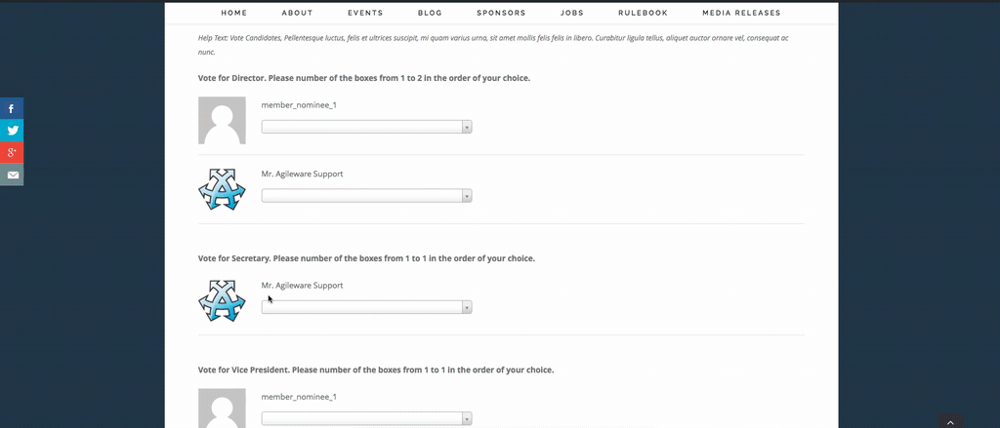
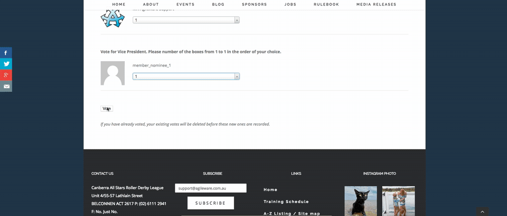

# How to vote

To vote in an election, you must be a permitted contact in CiviCRM (as defined in the Election Settings) and the election must be in its voting stage, between the **Voting Start Date** and **Voting End Date**.

1. Go to the **Elections** page on the website
2. Go to required **Election**
3. Click the **Vote in the Election** link 
   
4. Click the **Vote Now** link
     
5. Rank each Candidate in order of preference for each Position. You do not have to rank every candidate, or vote for every position, but if you rank any candidate for a position you must give one candidate the rank of 1, and each candidate for that position must be given a different rank.
     
6. Click **Vote** to record your vote.    

If the election's settings allow it, you can vote again at any time before **Voting End Date** to change your vote - your latest vote replaces your previous one. If changing your vote is not allowed, you cannot vote again once you have voted.